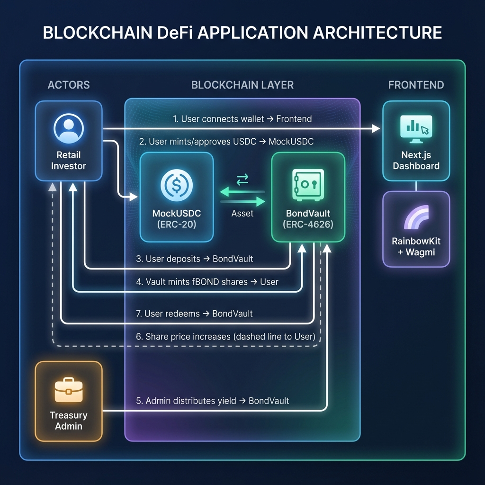
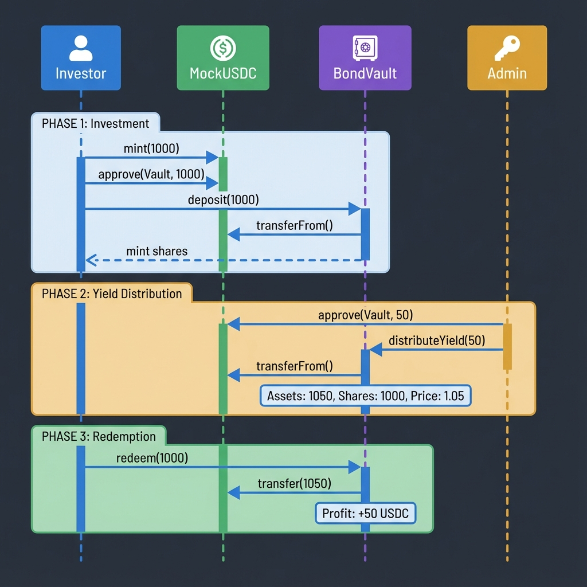

# 🏦 Fractional Tokenized Government Bond Platform (RWA)

A full-stack dApp enabling retail investors to access **fractionalized government bonds** using Stablecoins (USDC) via the ERC-4626 vault standard.

---

## 📁 Project Structure

```
trcked/
├── contracts/              # Solidity smart contracts
│   ├── BondVault.sol       # ERC-4626 yield vault
│   └── MockUSDC.sol        # Test stablecoin (6 decimals)
├── script/                 # Foundry deployment scripts
│   └── Deploy.s.sol
├── scripts/                # Node.js utilities
│   └── export-abi.js       # Export ABIs to frontend
├── frontend/               # Next.js web application
│   └── src/
│       ├── app/            # Pages (App Router)
│       └── constants/      # Contract addresses & ABIs
├── assets/                 # Documentation images
├── lib/                    # Foundry dependencies
└── README.md
```

---

## 🏗️ System Architecture



---

## 🔄 Sequence Diagram: Investment & Yield Cycle



---

## 🚀 Quick Start

### Prerequisites
- [Foundry](https://getfoundry.sh/) • [Node.js](https://nodejs.org/) v18+ • [MetaMask](https://metamask.io/)

### 1. Smart Contracts
```bash
forge install && forge build
node scripts/export-abi.js
anvil --port 8545

# Deploy (new terminal)
PRIVATE_KEY=0xac0974bec39a17e36ba4a6b4d238ff944bacb478cbed5efcae784d7bf4f2ff80 \
forge script script/Deploy.s.sol --rpc-url http://127.0.0.1:8545 --broadcast
```

### 2. Frontend
```bash
cd frontend && npm install && npm run dev
```

### 3. MetaMask
- Network: `http://127.0.0.1:8545` (Chain ID: `31337`)
- Import: `0xac0974bec39a17e36ba4a6b4d238ff944bacb478cbed5efcae784d7bf4f2ff80`

---

## ✨ Features

| Feature | Description |
|---------|-------------|
| **ERC-4626 Vault** | Industry-standard tokenized vault |
| **Yield Simulation** | Admin injects yield → share value increases |
| **Modern UI** | Dark-themed dashboard (Tailwind + Lucide) |
| **Web3 Ready** | RainbowKit wallet connection |

---

## 📜 Contract Addresses

| Network | MockUSDC | BondVault |
|---------|----------|-----------|
| Sepolia | `0x4f0e...953d` | `0xf0c7...d82f` |
| Anvil | `0x5FbD...0aa3` | `0xe7f1...0512` |

---

## 🛠️ Tech Stack

**Contracts**: Solidity 0.8.20, OpenZeppelin, Foundry  
**Frontend**: Next.js 14, TypeScript, Tailwind CSS  
**Web3**: Wagmi v2, viem, RainbowKit

---

**MIT License**
